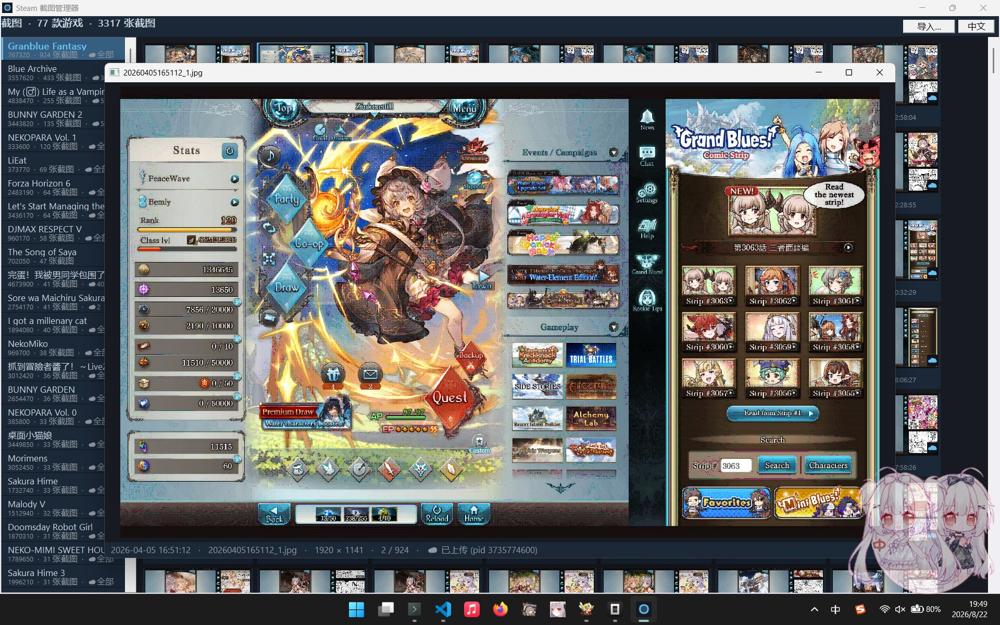
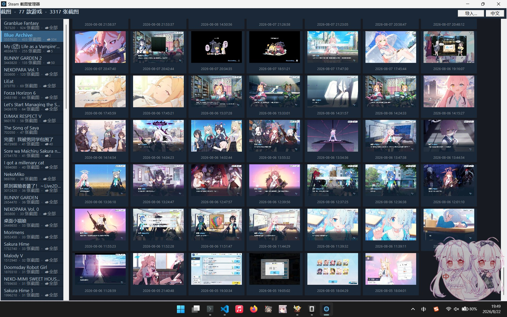
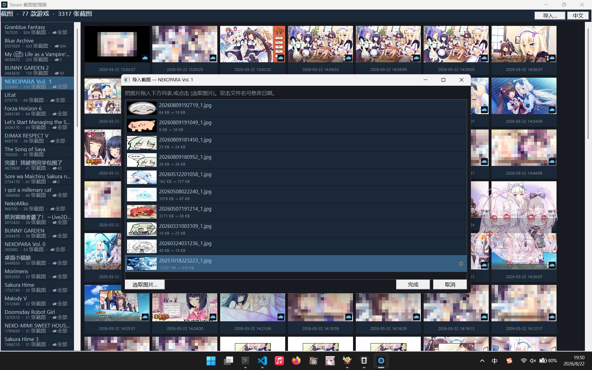

English | [中文](README.md)

# steamshot-mgr — Steam Screenshot Manager (Pure MFC)

A Steam screenshot manager written in **pure MFC** (no third-party UI libraries), styled after the built-in screenshot manager of the Steam client (dark theme). It browses all local Steam screenshots grouped by game and sorted by time, and ships with **image import** (format conversion / compression / auto-naming) and screenshot deletion.

## Screenshots

| Full-size Preview | Browse & Import | Import List (Convert & Compress) |
|:---:|:---:|:---:|
|  |  |  |

## Read/Write Policy

| Operation | Policy |
|-----------|--------|
| Browse / preview / scan | **Read-only**: files opened with `GENERIC_READ` only, registry with `KEY_READ` only, caches stay in memory |
| Import | **Explicit write**: files are written to the game's `screenshots\` and `thumbnails\` only after clicking Done **and confirming twice-checked dialog** |
| Delete | **Explicit write**: deletion requires confirmation and removes both the full image and its thumbnail |
| Export | **Explicit write**: writes only to the user-chosen destination folder; the Steam directories are never touched |

> During import, converted images are staged in `<Steam>\userdata\<user>\760\remote\tmp\` on disk to avoid holding large bitmaps in memory; leftovers are cleaned up automatically when you cancel or a conversion fails.
> Note: imported shots appear immediately in this tool; the Steam client itself may need a restart to pick them up.

## Features

### Browsing

- **Automatic Steam detection**: reads `HKCU\Software\Valve\Steam\SteamPath`, parses `libraryfolders.vdf` to collect every library folder (main + additional).
- **Screenshot scanning**: walks all users' `760\remote\<AppID>\screenshots\` directories and groups shots by game.
- **Timestamp sorting**: parses capture time from file names (`YYYYMMDDHHMMSS_N.jpg`), **newest first**, labeled `YYYY-MM-DD HH:MM:SS` under each thumbnail.
- **Game name mapping**: reads `name` from `appmanifest_*.acf` (Chinese supported); falls back to `App <AppID>` for uninstalled games. Offline mapping verification data: [docs/offline-appid-mapping.md](docs/offline-appid-mapping.md).
- **Virtualized grid**: never loads thousands of images at once — only visible cells are decoded by background threads with an LRU memory cache (max 300); switching games invalidates stale jobs.
- **Thumbnail strategy**: prefers Steam's own `thumbnails\`; falls back to decoding the original image when missing or corrupt.
- **Full-size preview**: double-click to open, aspect-fit scaling, `←`/`→` or `A`/`D` or click left/right half to navigate, `Esc` to close; status bar shows timestamp, file name, original resolution, index.
- **Context menu**: reveal in Explorer (`explorer /select`), delete shot + thumbnail (with confirmation; auto-refresh keeps current game selected).

### Import

- Entry point: the **[Import…]** button at the top-right (select a game on the left first).
- **Add pictures**: drag & drop from Explorer onto the list, or multi-select via [Browse]; any GDI+ decodable format works (jpg/png/bmp/gif/tif…).
- **Automatic conversion** (background thread, one image at a time):
  - non-JPEG input is re-encoded as JPEG;
  - anything over **1 MB** is compressed: quality steps down first (90→10), then resolution shrinks proportionally (×0.85 iterations) until it fits;
  - originals over **5 MB** get warning badge **①**; if it still can't fit into 1 MB at the limits, badge **②**; undecodable files get ✕;
  - results are staged in `760\remote\tmp\` on disk — no giant memory footprint.
- **Auto naming**: generates standard Steam names from each picture's **modification time** (`YYYYMMDDHHMMSS_1.jpg`); same-second collisions roll forward **+1 second** until unique — existing screenshots are never overwritten.
- **Edit date**: double-click a generated file name to edit it in place with a date-time control (`yyyy-MM-dd HH:mm:ss`); Enter commits, Esc cancels, clicking elsewhere commits; the name regenerates and re-resolves collisions.
- **Finish**: clicking Done shows a confirmation dialog (target game + count); after confirming, files are moved into `screenshots\` and matching `thumbnails\` are generated; the main view refreshes instantly.

### Export

- Entry point: the **[Export…]** button to the right of Import (select a game on the left first).
- **Requires ffmpeg**: on click, ffmpeg is looked up in `PATH`; if missing, a dialog offers the download page (one click to open). A ffmpeg build without an AV1 encoder (`libsvtav1` or `libaom-av1` — the gyan.dev full build has both) is reported as well.
- **Output location**: pick any target folder; a sub-folder named after the game is created inside (NTFS-illegal characters `\ / : * ? " < > |` are transliterated to full-width).
- **Format & naming**: every screenshot is converted to **AVIF** via ffmpeg (CRF 25, ≈60% compression), named after the screenshot timestamp `YYYY-MM-DD-HH-MM-SS.avif`; same-second collisions roll forward +1 second — nothing is ever overwritten.
- **File times**: after export, creation/modification times are set to the timestamp in the file name.
- **Dynamic concurrency**: starts with 2 ffmpeg processes and auto-scales between 1 and the logical core count based on CPU utilization (<90% add, >98% drop) to keep the CPU just saturated.
- **Progress & cancel**: live progress (done/total, current file) and a failure list; [Cancel export] kills running jobs instantly and summarizes what was finished.

## Requirements

- Windows 10/11 x64
- Visual Studio 2026 (v145 toolset, MFC shared DLL) + Windows SDK 10.0.26100 or later
- Runtime depends on MFC shared DLLs (VS2026 redistributables)
- **Export feature** requires [ffmpeg](https://www.gyan.dev/ffmpeg/builds/) (full build) with its folder added to `PATH`

Environment check during development: MFC/ATL shipped with VS2026 is the latest version (`_MFC_VER 0x0E00`) with complete x86+x64 libraries.

## Project Layout

```
steamshot-mgr/
├─ steamshot-mgr.sln
├─ docs/
│  └─ offline-appid-mapping.md   # Offline AppID→game-name mapping notes & data
└─ steamshot-mgr/
   ├─ steamshot-mgr.vcxproj      # VS2026, v145, x64, MFC shared DLL, /utf-8
   ├─ steamshot-mgr.cpp/.h       # CWinApp entry (GDI+ startup/shutdown)
   ├─ MainFrame.cpp/.h           # Main window (list + grid + header w/ import)
   ├─ steamshot-mgr.rc           # Resources (icon/dialogs/accelerators/version)
   ├─ core/
   │  ├─ SteamLocator.*          # Registry + libraryfolders.vdf library discovery
   │  ├─ VdfParser.*             # Text KeyValues parser (acf/vdf, read-only)
   │  ├─ GameCatalog.*           # AppID→game name (appmanifest), App <id> fallback
   │  ├─ ScreenshotStore.*       # Scan shots, parse timestamps, sort desc
   │  ├─ ImageImporter.*         # JPEG conversion/compression (quality→size)/warnings
   │  ├─ ShotNameGen.*           # Standard name generation + second-rolling dedupe
   │  └─ Exporter.*              # ffmpeg locate/encoder probe/AVIF export/file times
   └─ ui/
      ├─ Theme.*                 # Steam dark palette & fonts
      ├─ I18n.*                  # EN/中文 UI language (system default, switchable)
      ├─ GameListCtrl.*          # Owner-drawn game list
      ├─ ThumbGridView.*         # Virtualized thumb grid (bg decode+LRU+context menu)
      ├─ PreviewDlg.*            # Full-size preview (keyboard/click navigation)
      ├─ ImportDlg.*             # Import dialog (drop/convert/rename/confirm)
      └─ ExportDlg.*             # Export progress (dynamic concurrency/cancel/failures)
```

## Build & Run

1. Open `steamshot-mgr.sln` in **Visual Studio 2026**.
2. Pick `Debug | x64` or `Release | x64` and build.
3. Output: `x64\<config>\steamshot-mgr.exe`.

Or via MSBuild:

```bat
"C:\Program Files\Microsoft Visual Studio\18\Community\MSBuild\Current\Bin\MSBuild.exe" steamshot-mgr.sln -p:Configuration=Release -p:Platform=x64
```

## Usage

| Action | Result |
|--------|--------|
| Click a game on the left | Show its screenshots on the right (newest first) |
| Double-click a thumbnail | Full-size preview |
| `←`/`→` or `A`/`D` in preview | Previous / next |
| Click left/right half of image | Previous / next |
| `Esc` in preview | Close preview |
| Right-click a thumbnail | Reveal in Explorer / delete shot + thumbnail (confirmed) |
| Top-right [Import…] | Open the import dialog for the selected game |
| Drop files / [Browse] in dialog | Add pictures; conversion & compression run in background |
| Double-click a generated file name | Edit date-time; name regenerates automatically |
| [Done] in dialog | Write to `screenshots\` + `thumbnails\` after confirmation |
| Top-right [Export…] | Detect ffmpeg → pick destination → batch-convert to AVIF under a `game-name\` sub-folder |
| [Cancel export] in progress | Kill running jobs, keep finished ones, show summary |
| `Ctrl+R` in main window | Rescan screenshots |
| Resize window | Grid columns adapt |

## License

For personal study and use only.
